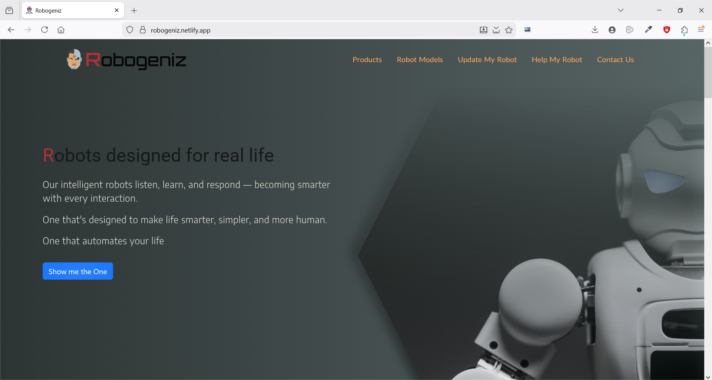
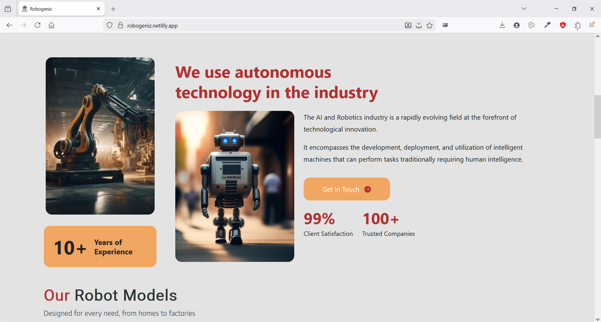
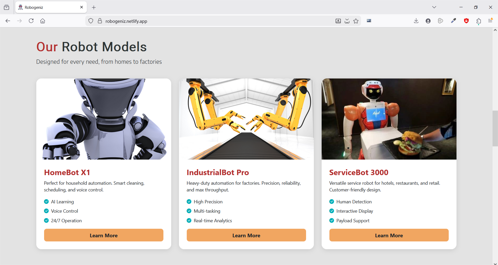
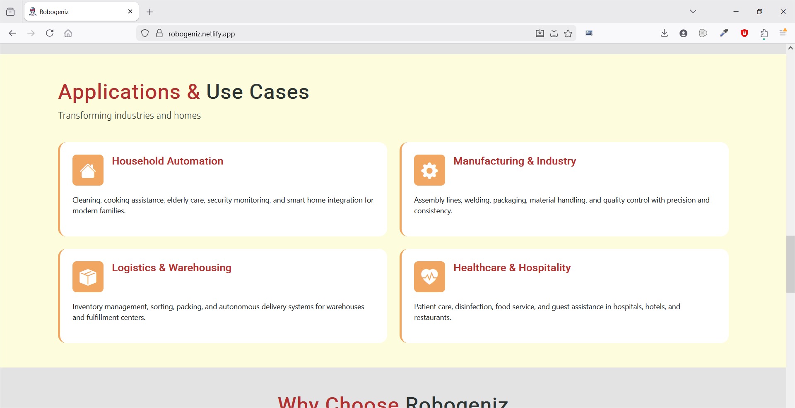
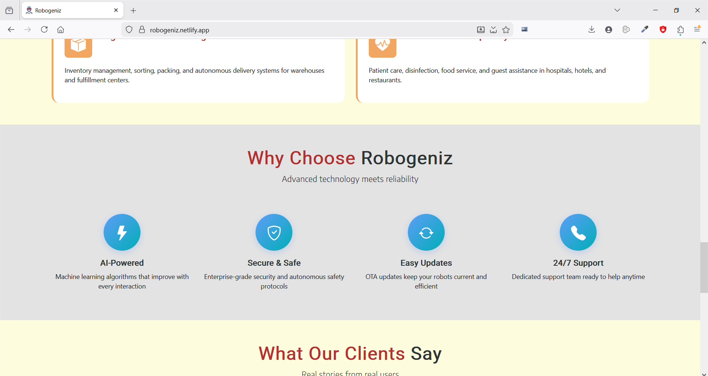
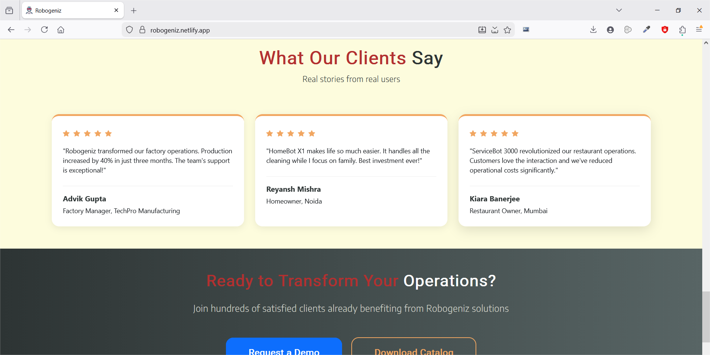
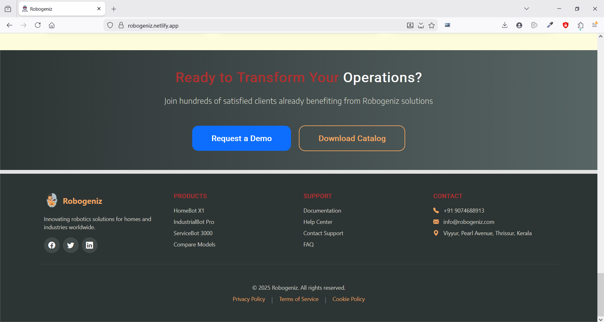

# 🤖 Robogeniz — Robotics Company Landing Page

Robogeniz is a **frontend-only homepage** for a fictional **robot model development company** building robots for homes, industries, factories, and commercial environments such as hotels and service spaces.

This project focuses on  **clean UI engineering, UI design, scalable SCSS architecture, and controlled interaction design.**

---

## 🎯 Project Goals

* Design a **modern, professional fictional tech brand interface** from scratch without being a clone of any existing websites.
* Build a **well-structured, responsive landing page**
* Customize  **Bootstrap at the SCSS level** , not override it blindly
* Keep animations **minimal, intentional, and performance-aware**
* Demonstrate **frontend fundamentals without frameworks**

---

## 🔗 Live Demo

👉 [robogeniz.netlify.app](https://robogeniz.netlify.app)

---

## 📸 Screenshots & UI Walkthrough

A visual overview of Robogeniz’s homepage, highlighting structure, responsiveness, and interaction flow.

### 🤖 Navigation Menu & Hero / Intro Section

**Details:**

* Clean, responsive navigation with clear hierarchy and theme-aligned styling
* Strong brand introduction using bold typography, color contrast, and subtle motion.



..................................................................................................

### 📊 About Us Summary + Stats

**Details:** Concise company overview supported by structured stats for quick credibility.



..................................................................................................

### 🧩 Products Section

**Details:** Clearly organized product cards focused on clarity and scannability.



..................................................................................................

### 🏭 Use Cases

**Details:** Maps robots to real-world environments using structured, responsive layouts.



..................................................................................................

### ⚙️ Features Section

**Details:** Feature blocks with subtle reveal animations for guided attention.



..................................................................................................

### 💬 Testimonials

**Details:** Social proof presented with balanced typography and minimal motion.



..................................................................................................

### 📬 Call to Action (CTA) and Footer

**Details:**

* Visually distinct section designed to naturally guide user conversion.
* Clean closure with consistent branding and supporting links.



---

## 🧩 Page Sections

The homepage is structured as a single, cohesive flow:

* **Nav Menu** — Responsive navigation with brand identity
* **Intro / Hero** — Clear positioning and first impression
* **About Us Summary** — Company overview with animated stats
* **Products** — Robot models and offerings
* **Use Cases** — Home, industrial, factory, and service environments
* **Features** — Core capabilities and differentiators
* **Testimonials** — Social proof and credibility
* **CTA** — Conversion-focused call to action
* **Footer** — Supporting links and brand closure

Each section is  **individually styled, responsive** , and designed to feel consistent as part of a single system.

---

## ✨ Interaction & UI Behavior

* **Scroll-based section reveal** using `IntersectionObserver`
* Subtle **entry animations** for improved visual flow
* Intentional animation restraint — no distracting motion
* Responsive behavior across breakpoints
* Custom SVG brand icon integrated into the design system

All interactions are **DOM-driven** and intentionally minimal.

---

## 🎨 Styling & SCSS Architecture

SCSS is organized for  **clarity, scalability, and maintainability** :

```
scss/
├── base/
│   ├── _variables.scss
│   ├── _fonts.scss
│   ├── _mixins.scss
│
├── components/
│   └── svg_style.scss
│
├── sections/
│   ├── _navmenu.scss
│   ├── _intro.scss
│   ├── _summary.scss
│   ├── _products.scss
│   ├── _usecases.scss
│   ├── _features.scss
│   ├── _testimonials.scss
│   ├── _cta.scss
│   └── _footer.scss
```

Each section owns its layout, responsiveness, and relevant animations.

---

## 🎨 Theme System & Bootstrap Customization

Bootstrap is  **intentionally customized at the SCSS level** , not overridden after compilation.

A custom theme layer is introduced before Bootstrap is compiled, allowing the design system to remain **consistent, scalable, and framework-aligned** rather than fighting default styles.

**Key characteristics:**

* Centralized color tokens defined once and reused everywhere
* Bootstrap’s theme map extended to include brand-specific colors
* Global variables (backgrounds, link behavior, accents) adjusted before Bootstrap styles are generated
* Zero post-build overrides or hacky CSS fixes

This approach preserves Bootstrap’s utility while keeping the visual identity  **fully brand-driven** .

---

## 🧠 JavaScript Architecture (main.js)

JavaScript is used  **sparingly and purposefully** , focusing only on interaction and state that cannot be expressed through CSS alone.

**Core responsibilities:**

* Revealing sections using the Intersection Observer API
* Triggering animations only when sections enter the viewport
* Ensuring animations run once and do not re-trigger unnecessarily

There are no heavy abstractions, frameworks, or animation libraries

---

## ✨ Interaction Philosophy

Robogeniz follows a  **design-first interaction model** :

* Animations support hierarchy and storytelling
* Motion is subtle, restrained, and purposeful
* No decorative effects without UX justification
* JavaScript enhances the experience without dominating it

So as to make the site professional, modern, and aligned (or atleast close to) with real-world product standards.

---

## 🛠 Tech Stack

* **HTML5**
* **SCSS (modular architecture)**
* **JavaScript (Vanilla)**
* **Bootstrap (SCSS-customized)**

---

## 🚀 Why This Project Matters

Robogeniz demonstrates:

* Strong frontend fundamentals
* Bootstrap customization at source level
* Scalable SCSS architecture
* Controlled DOM-based interactions
* Design restraint and visual consistency

---

## 📄 License

MIT

---
